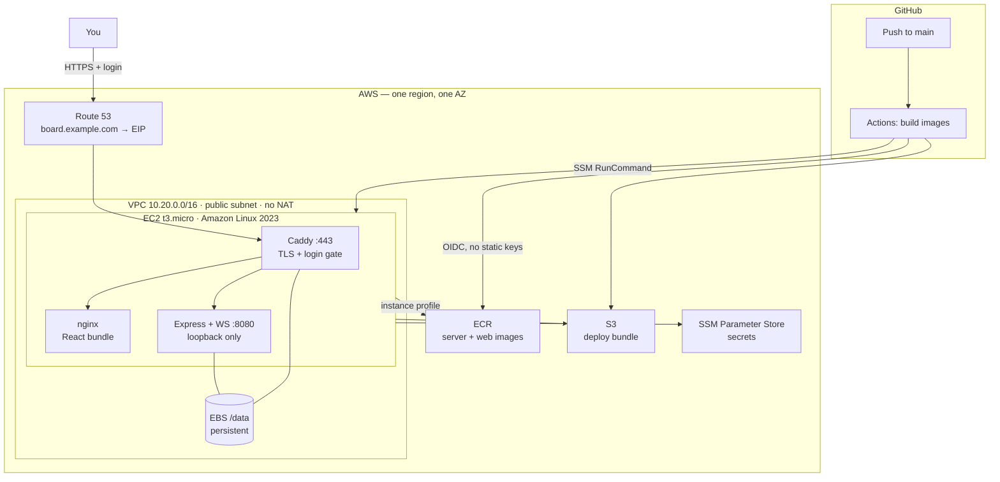

# Deploying the AI Agent Board to AWS

This is a complete, private, single-host deployment: the board runs on one
always-on EC2 instance, is served over HTTPS at a Route 53 hostname, and asks
for credentials before anyone — including a search-engine crawler or a passing
scanner — sees a single pixel of it.

Everything is in this repository:

| Path | What it is |
|------|------------|
| `infra/terraform/` | The AWS stack (VPC, EC2, EBS, ECR, S3, IAM, SSM, Route 53) |
| `infra/deploy/` | What runs on the host: compose stack, reverse-proxy config, deploy script |
| `infra/scripts/` | One-time Terraform state bootstrap |
| `.github/workflows/deploy-aws.yml` | Build → push → deploy pipeline |
| `.github/workflows/infra.yml` | Terraform plan/apply |
| `packages/client/Dockerfile` | Frontend image (Vite build → nginx) |
| `packages/server/Dockerfile` | Backend image (already existed) |

---

## Architecture



**Request path.** Caddy is the only process bound to a public port. It
terminates TLS with a Let's Encrypt certificate it obtains and renews itself,
requires a login for every path, then routes `/api` and `/ws` to the backend and
everything else to the static bundle. The backend publishes only to `127.0.0.1`,
so there is no way to reach it that skips the login.

**Deploy path.** GitHub Actions assumes an IAM role through OIDC, pushes both
images to ECR, syncs `infra/deploy/` to S3, and asks SSM to run one command on
the instance. The instance pulls the new bundle from S3, reads its secrets from
Parameter Store, pulls the images with its instance profile, and restarts the
stack.

### The four decisions that shape this

**No inbound SSH; OIDC over access keys.** Deploys arrive over SSM Run Command,
which the instance dials out to, so the security group has no port 22 rule. Both
workflows prefer an IAM role assumed through GitHub's OIDC provider, which means
no standing credential in the repository — the blast radius of a leaked GitHub
token is "can push an image and trigger a deploy", not "has your AWS account".

Static access keys are supported as the **bootstrap** path, because the OIDC
role is created *by* this stack and therefore cannot be used for the first
apply. Once `terraform apply` has run, set the role ARN and delete the keys; the
workflows use the role whenever it is present. See
[Bootstrapping from CI](#step-2b--or-apply-from-ci-with-access-keys).

**ECR instead of a public registry.** A private image needs a credential
somewhere. With ECR that credential is the instance profile and the CI OIDC
role — both short-lived and rotated by AWS. With Docker Hub or GHCR you would
park a long-lived personal access token on the instance forever. ECR storage
runs a few cents a month at the retention set here, and in-region pulls are free.

**Config ships separately from images.** The compose file, both Caddyfiles and
`deploy.sh` travel through S3, not baked into an image or into user data.
Changing the proxy config or the deploy logic is a normal commit, not an
instance replacement.

**State lives on its own volume.** The SQLite database, cloned repositories and
TLS certificates sit on a separate EBS volume mounted at `/data`, marked
`prevent_destroy`. The instance is disposable — change the AMI or the bootstrap
and Terraform can replace it while the data stays put.

### What is *not* here, and why

- **No load balancer.** An ALB is ~$16/month, more than everything else
  combined, to front a single instance. Caddy does TLS for free.
- **No NAT gateway.** ~$32/month. The instance sits in a public subnet and
  talks to AWS services through the internet gateway.
- **No CloudWatch agent / log shipping.** Custom metrics and log ingestion
  leave the free tier quickly. Logs are `docker logs` and journald, rotated at
  10 MB × 3 per container.
- **No Vercel frontend.** The frontend moved onto the instance deliberately: a
  Vercel-hosted bundle is public, and "only we can access it" has to include the
  UI, not just the API. `vercel.json` is untouched if you want to keep that path
  for something else.

---

## Cost

Two things cost money no matter what, on day one:

| Item | Cost | Notes |
|------|------|-------|
| Route 53 hosted zone | **$0.50/month** | Per zone. Reuse an existing zone — do not create a second one for the same domain. |
| DNS queries | ~$0.00 | $0.40 per million; a private board will not register. |

Everything else depends on how old the AWS account is. AWS has changed free-tier
terms more than once, so **check the [current free tier page](https://aws.amazon.com/free/)
before assuming** — the shape below is what to expect, not a guarantee:

| Item | Under the 12-month free tier | After it expires |
|------|------------------------------|------------------|
| EC2 `t3.micro` | 750 h/month — covers one always-on instance | ~$7.60/month on-demand |
| EBS gp3 30 GiB | included (20 root + 10 data) | ~$2.40/month |
| Public IPv4 address | 750 h/month | ~$3.60/month |
| ECR storage | 500 MB | ~$0.10–0.50/month at 5 retained images |
| S3 deploy bundle | included | pennies |
| SSM, Parameter Store (Standard), IAM, VPC, security groups | always free | always free |
| Data transfer out | 100 GB/month free | 100 GB/month free |

**Roughly: $0.50/month for the first year, then $14–15/month.** A one-year
Compute Savings Plan takes about a third off the instance line. If you want to
stay closer to free after year one, the levers are instance size and whether you
need a public IPv4 at all — not this architecture.

> Accounts created since mid-2025 may be on the newer credit-based free plan
> (a fixed credit grant that expires) rather than the 12-month service-by-service
> free tier. The stack is identical either way; only the bill differs.

**A real caveat about `t3.micro`:** 1 GB of RAM is enough to serve the board and
run light agent sessions, and the bootstrap adds 2 GB of swap so memory spikes
degrade instead of OOM-killing. Serious concurrent agent work wants
`t3.small`/`t4g.small` (2 GB). Change `instance_type` and re-apply; nothing else
in the stack cares.

---

## Prerequisites

- An AWS account, and local credentials with permission to create the stack.
- Terraform **1.10+** (S3-native state locking).
- A domain in Route 53 — either an existing hosted zone, or a domain whose
  registrar nameservers you can repoint.
- Admin on the GitHub repository (to set Actions secrets and variables).

---

## Step 1 — Terraform state (optional but recommended)

Local state works for a solo operator, but CI needs shared state:

```bash
./infra/scripts/bootstrap-tf-state.sh
# then uncomment the backend block in infra/terraform/backend.tf with the
# printed values and run: terraform init -migrate-state
```

## Step 2 — Apply the infrastructure (locally)

```bash
cd infra/terraform
cp terraform.tfvars.example terraform.tfvars
$EDITOR terraform.tfvars       # domain_name, hosted_zone_name, acme_email

terraform init
terraform apply
```

This creates the VPC, instance, volumes, ECR repositories, S3 bucket, IAM roles,
the SSM parameter placeholders and the DNS record. The instance boots, formats
and mounts `/data`, installs Docker, and reports that there is no deploy bundle
yet — which is correct at this point.

If you set `create_hosted_zone = true`, point your registrar at the nameservers
in the `hosted_zone_nameservers` output and wait for propagation before the
first deploy, or Caddy's certificate request will fail.

## Step 2b — or, apply from CI with access keys

If you would rather not run Terraform locally, the **Terraform (infra)**
workflow can do the first apply. It needs credentials and the three required
inputs, all set under **Settings → Secrets and variables → Actions**:

| Kind | Name | Value |
|------|------|-------|
| Secret | `AWS_ACCESS_KEY` (or `AWS_ACCESS_KEY_ID`) | access key id |
| Secret | `AWS_SECRET_ACCESS_KEY` | secret access key |
| Variable | `BOARD_DOMAIN` | `board.example.com` |
| Variable | `HOSTED_ZONE_NAME` | `example.com` |
| Variable | `ACME_EMAIL` | `you@example.com` |
| Variable | `AWS_REGION` | e.g. `us-east-1` (optional, defaults to `us-east-1`) |

Optional overrides: `AUTH_MODE`, `INSTANCE_TYPE`, `CREATE_HOSTED_ZONE`,
`TF_STATE_BUCKET`, `TF_STATE_KEY`.

Then run **Actions → Terraform (infra) → Run workflow** and type `apply`. The
workflow creates the remote state bucket if it does not exist (versioned,
encrypted, public access blocked; named `agentboard-tfstate-<account-id>` unless
`TF_STATE_BUCKET` says otherwise), plans, applies, and prints the repository
variables for Step 4 in the run summary.

Until those variables are set, a pull request touching `infra/terraform/`
degrades to a credential-free `terraform validate` rather than failing — but a
dispatched run fails loudly and names what is missing.

**After the first apply**, switch to OIDC and delete the keys:

```bash
terraform -chdir=infra/terraform output -raw github_actions_role_arn
# store as the AWS_DEPLOY_ROLE_ARN secret (and AWS_TERRAFORM_ROLE_ARN for infra),
# then delete AWS_ACCESS_KEY / AWS_SECRET_ACCESS_KEY
```

## Step 3 — Populate the secrets

Terraform created every parameter with a `REPLACE_ME` placeholder and then
stopped tracking its value, so no secret ever lands in Terraform state. Deploys
refuse to run until the required ones are set.

```bash
PREFIX=/agentboard/prod        # `terraform output ssm_parameter_prefix`

# Bearer token between the proxy and the backend. Hex, so it is URL-safe in the
# WebSocket query string.
aws ssm put-parameter --name $PREFIX/API_KEY --type SecureString --overwrite \
  --value "$(openssl rand -hex 32)"

# Agent + GitHub credentials (optional, but the board does very little without them)
aws ssm put-parameter --name $PREFIX/ANTHROPIC_API_KEY --type SecureString --overwrite --value "sk-ant-..."
aws ssm put-parameter --name $PREFIX/GH_TOKEN          --type SecureString --overwrite --value "ghp_..."
```

Then the login itself — pick one mode.

### Mode A: `auth_mode = "basic"` (default)

One username and password, no third-party setup. Generate a bcrypt hash:

```bash
docker run --rm caddy:2-alpine caddy hash-password --plaintext 'your-strong-password'

aws ssm put-parameter --name $PREFIX/BASIC_AUTH_USER --type String       --overwrite --value 'mike'
aws ssm put-parameter --name $PREFIX/BASIC_AUTH_HASH --type SecureString --overwrite --value '$2a$14$...'
```

Quote the hash in single quotes — it is full of `$`.

### Mode B: `auth_mode = "oauth"`

Sign in with GitHub, restricted to named accounts. Create an OAuth app at
**GitHub → Settings → Developer settings → OAuth Apps**:

- Homepage URL: `https://board.example.com`
- Authorization callback URL: `https://board.example.com/oauth2/callback`

```bash
aws ssm put-parameter --name $PREFIX/OAUTH2_PROXY_CLIENT_ID     --type String       --overwrite --value 'Iv1....'
aws ssm put-parameter --name $PREFIX/OAUTH2_PROXY_CLIENT_SECRET --type SecureString --overwrite --value '...'
aws ssm put-parameter --name $PREFIX/OAUTH2_PROXY_COOKIE_SECRET --type SecureString --overwrite \
  --value "$(openssl rand -base64 32 | tr -d '\n' | tr '+/' '-_')"
# Comma-separated GitHub logins allowed in. Everyone else is refused after login.
aws ssm put-parameter --name $PREFIX/OAUTH2_PROXY_GITHUB_USER   --type String       --overwrite --value 'devmikeroberts'
```

Set `auth_mode = "oauth"` in `terraform.tfvars` and re-apply (it is baked into
the instance configuration, so this replaces the instance — `/data` survives).

## Step 4 — Wire up GitHub Actions

`terraform output github_actions_repo_variables` prints the values. Under
**Settings → Secrets and variables → Actions**:

| Kind | Name | Value |
|------|------|-------|
| Secret | `AWS_DEPLOY_ROLE_ARN` | `terraform output github_actions_role_arn` |
| Variable | `AWS_REGION` | e.g. `us-east-1` |
| Variable | `AWS_DEPLOY_BUCKET` | `terraform output deploy_bucket` |
| Variable | `ECR_SERVER_REPO` | `terraform output ecr_server_repository` |
| Variable | `ECR_WEB_REPO` | `terraform output ecr_web_repository` |
| Variable | `EC2_NAME_TAG` | `terraform output instance_name_tag` |
| Variable | `IMAGE_PLATFORM` | `linux/amd64`, or `linux/arm64` for `t4g.*` |

Optionally, for the Terraform workflow: secret `AWS_TERRAFORM_ROLE_ARN` and
variables `TF_STATE_BUCKET`, `TF_STATE_KEY`.

Until `AWS_DEPLOY_ROLE_ARN` and `AWS_DEPLOY_BUCKET` exist, the deploy workflow
skips itself with a notice instead of failing every push.

## Step 5 — Deploy

Push to `main`, or run **Actions → Deploy to AWS → Run workflow**. The run
builds both images, publishes the deploy bundle, and streams the instance-side
output back into the job log.

The first deploy takes a few minutes longer than later ones: the instance is
pulling ~2 GB of images on a burstable NIC, and Caddy is completing its first
ACME challenge. Then:

```
https://board.example.com   →   login   →   the board
```

---

## Operating it

**Get a shell** (no SSH key, no open port):

```bash
aws ssm start-session --target "$(terraform -chdir=infra/terraform output -raw instance_id)"
sudo -i
cd /opt/agentboard && docker compose ps
```

**Logs:**

```bash
docker compose logs -f server          # application
docker compose logs -f caddy           # TLS + auth + routing
tail -f /var/log/agentboard-bootstrap.log   # first-boot provisioning
journalctl -u agentboard.service       # boot-time re-deploy
```

**Redeploy or roll back** — every deploy records the tag it applied, and a
failed health check rolls back automatically. To go back deliberately, run the
workflow with an `image_tag` input (any commit SHA still in ECR), or on the box:

```bash
/usr/local/bin/agentboard-deploy <sha>
```

**Rotate a secret:**

```bash
aws ssm put-parameter --name $PREFIX/API_KEY --type SecureString --overwrite --value "$(openssl rand -hex 32)"
/usr/local/bin/agentboard-deploy        # re-renders the env files and restarts
```

Nothing needs rebuilding — no secret is baked into an image.

**Resize:** change `instance_type` (and `instance_architecture` plus the
`IMAGE_PLATFORM` variable if you cross between Intel and Graviton) and apply.
The instance is replaced; `/data` and the Elastic IP are not.

**Back up the database:**

```bash
aws ssm start-session --target <instance-id>
sudo cp /data/agentboard/agentboard.db /tmp/backup.db      # SQLite is a single file
```

Or take an EBS snapshot of the data volume — the durable option, and the one
worth putting on a schedule if the board holds work you care about.

---

## Security posture

- **Two independent gates.** The edge requires a login; the backend
  independently requires a bearer token that the browser never receives (Caddy
  injects it). Compromising the bundle does not yield the API token.
- **No inbound management path.** Port 22 is closed by default. Port 80 serves
  only the ACME challenge and the redirect to 443.
- **IMDSv2 enforced**, hop limit 2 — the standard SSRF-to-credentials path
  against a public service is closed.
- **Secrets never in state, images, or git.** They live in Parameter Store,
  encrypted, read at deploy time by the instance profile, written to
  `chmod 600` env files split per service so the proxy container never holds
  the agent keys.
- **Least-privilege CI.** The deploy role can push to two ECR repositories,
  write one S3 prefix, and run `AWS-RunShellScript` on one instance.
- **`enable_container_mode` is off by default.** Turning it on mounts the host
  Docker socket into the backend, which is root-equivalent on the host. It is a
  reasonable trade behind a login gate, but it is a real one — make it
  deliberately.

Encrypted EBS, TLS-only S3, blocked public access and versioned buckets are all
on by default.

---

## Troubleshooting

**The site does not get a certificate.** Caddy needs `board.example.com` to
resolve to the Elastic IP *and* port 80 reachable from anywhere. Check
`dig +short board.example.com` against `terraform output instance_public_ip`,
then `docker compose logs caddy`. Let's Encrypt rate-limits failures, so fix DNS
before retrying repeatedly.

**Deploy fails with "unpopulated parameters".** Step 3 is incomplete — the
message lists exactly which parameter names are still placeholders.

**The deploy job cannot find the instance.** `EC2_NAME_TAG` must match
`terraform output instance_name_tag`, and the instance must be running in
`AWS_REGION`.

**SSM says the instance is not available.** The SSM agent needs a few minutes
after first boot, plus outbound HTTPS and the instance profile.
`aws ssm describe-instance-information` shows what SSM can see.

**Deploy succeeds, board is slow or tasks die.** Almost always memory on
`t3.micro`. `free -h` and `dmesg | grep -i oom` will say so; move to a 2 GB
instance type.

---

## Teardown

The data volume is protected on purpose:

```bash
cd infra/terraform
# 1. take a final EBS snapshot if you want the data
# 2. remove the `prevent_destroy` lifecycle block from aws_ebs_volume.data
terraform destroy
```

If you created the hosted zone here, destroying it stops the $0.50/month charge.
An existing zone you reused is left alone.
